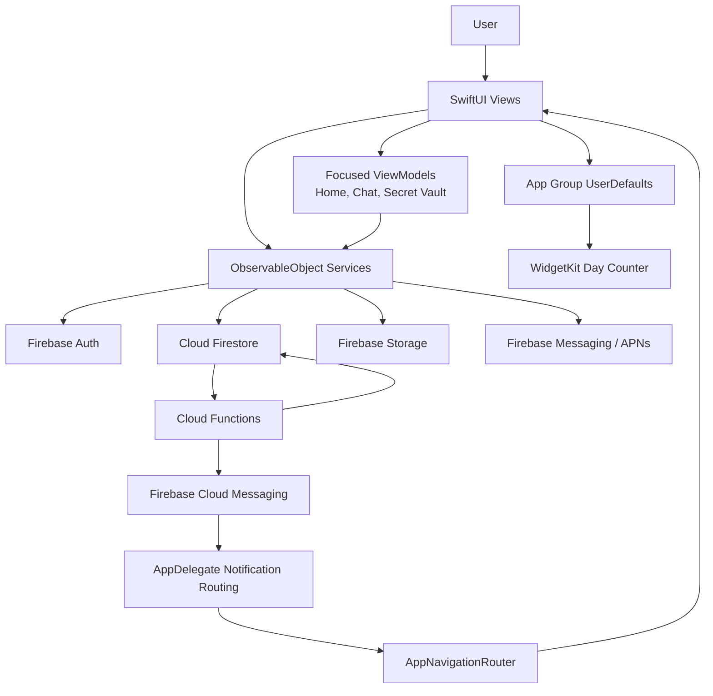

# Sevgilim

<p align="center">
  <strong>A private SwiftUI relationship app for two people to share memories, photos, plans, notes, stories, messages, places, songs, surprises, and special days.</strong>
</p>

<p align="center">
  
  
  
  
</p>

<p align="center">
  
  
  
  
</p>

---

## Table Of Contents

- [Overview](#overview)
- [What The App Does](#what-the-app-does)
- [Project Snapshot](#project-snapshot)
- [Architecture](#architecture)
- [Application Flow](#application-flow)
- [Feature Matrix](#feature-matrix)
- [Backend And Data Model](#backend-and-data-model)
- [Notifications](#notifications)
- [Offline, Cache, And Performance Strategy](#offline-cache-and-performance-strategy)
- [Widget Extension](#widget-extension)
- [Security And Privacy](#security-and-privacy)
- [Repository Structure](#repository-structure)
- [Requirements](#requirements)
- [Setup](#setup)
- [Running The App](#running-the-app)
- [Testing And Quality Checks](#testing-and-quality-checks)
- [Deployment](#deployment)
- [Configuration Reference](#configuration-reference)
- [Known Limitations](#known-limitations)
- [Roadmap](#roadmap)
- [Maintenance Notes](#maintenance-notes)
- [License](#license)

---

## Overview

**Sevgilim** is a Turkish-first iOS application built for a private couple experience. The product model is intentionally small and personal: one authenticated user pairs with one partner through an invitation, and both users then share a single relationship workspace.

Inside that workspace, the app brings together:

- A relationship dashboard with names, day counter, statistics, greetings, mood status, upcoming plans, nearby partner status, and special-day reminders.
- A memory timeline with photos, likes, comments, tags, and locations.
- A media gallery for photos and videos.
- Private notes, movies, plans, places, songs, surprises, and special days.
- Realtime chat with image messages, typing indicator, read state, reactions, deletion modes, and local chat clearing.
- Instagram-style stories with views, likes, thumbnails, and 24-hour expiry behavior.
- A PIN-protected secret vault for private photo/video media.
- Push notifications and in-app notification history backed by Cloud Functions.
- A WidgetKit day-counter widget powered by an App Group shared store.

The app is implemented with SwiftUI and Firebase. It uses a pragmatic MVVM-plus-services structure: SwiftUI views own UI state, view models consolidate higher-level screen behavior where needed, and feature services own Firestore listeners, writes, uploads, cache interaction, and lifecycle cleanup.

---

## What The App Does

Sevgilim is not a social network. It is a two-person shared space. That design choice appears throughout the codebase:

- Data is partitioned by `relationshipId`.
- Firestore and Storage rules verify that the signed-in user belongs to the relationship before reading or writing shared data.
- Partner invitations create the relationship and link both user documents.
- Feature services listen only to the current relationship's collections.
- Push notifications usually target the partner or both relationship members.
- App navigation routes notification types directly to the relevant relationship feature.

The user experience is built around emotional continuity: memories, daily mood, stories, surprise reveals, anniversaries, plan reminders, "on this day" flashbacks, and inactivity nudges.

---

## Project Snapshot

| Area | Current Value |
| --- | --- |
| App target | `sevgilim` |
| Widget target | `sevgilimWidgetExtension` |
| Test target | `sevgilimTests` |
| Main bundle ID | `adilemre.sevgilim` |
| Widget bundle ID | `adilemre.sevgilim.sevgilimWidget` |
| App Group | `group.com.sevgilim.shared` |
| Schemes | `sevgilim`, `sevgilimTests`, `sevgilimWidgetExtension` |
| Build configurations | `Debug`, `Release` |
| iOS deployment target | App/widget: `26.0`; tests: `26.1` |
| Local Xcode used for analysis | Xcode `26.3` |
| Swift project setting | Swift language mode `5.0` |
| Firebase iOS package rule | `firebase-ios-sdk` from `12.4.0` up to next major |
| Resolved Firebase iOS SDK | `12.8.0` |
| Firebase products linked | `FirebaseAuth`, `FirebaseFirestore`, `FirebaseStorage`, `FirebaseMessaging` |
| Cloud Functions runtime | Node.js `22` |
| UI language | Turkish |

---

## Architecture



### Core Layers

| Layer | Responsibility | Key Files |
| --- | --- | --- |
| App bootstrap | Firebase setup, Firestore persistence, push delegate setup, dependency injection | `sevgilim/sevgilimApp.swift`, `sevgilim/Utilities/AppDependencies.swift` |
| Auth gate | Routes unauthenticated, unpaired, and paired states | `sevgilim/ContentView.swift` |
| Navigation shell | Five-tab shell, hamburger feature entry points, staggered service startup | `sevgilim/Views/MainTabView.swift`, `sevgilim/Views/Home/HomeView.swift` |
| Views | SwiftUI screens and reusable UI components | `sevgilim/Views/**` |
| View models | Screen-level orchestration for complex views | `sevgilim/ViewModels/HomeViewModel.swift`, `ChatViewModel.swift`, `SecretVaultViewModel.swift` |
| Services | Firestore listeners, writes, uploads, Firebase APIs, feature state | `sevgilim/Services/**` |
| Utilities | Navigation, caching, offline data, haptics, push token sync, pickers, theme, network | `sevgilim/Utilities/**` |
| Models | Codable/Identifiable Firestore models | `sevgilim/Models/**` |
| Backend rules | Firestore and Storage authorization/validation | `sevgilim/firebase/firestore.rules`, `sevgilim/firebase/storage.rules` |
| Cloud Functions | Notification fan-out, scheduled reminders, unread count sync | `functions/index.js` |
| Widget | Day-counter widget and scaffolded WidgetKit extras | `sevgilimWidget/**` |
| Tests | Unit tests and mocks | `sevgilimTests/**` |

---

## Application Flow

1. `sevgilimApp` starts the app, configures Firebase, enables Firestore persistent cache with a 50 MB size, starts network monitoring, registers notification delegates, requests notification permission, and injects shared service objects into the SwiftUI environment.
2. `ContentView` decides the initial route:
   - Signed out: `LoginView`
   - Signed in without `relationshipId`: `PartnerSetupView`
   - Signed in with `relationshipId`: `MainTabView`
3. `MainTabView` renders the primary tabs:
   - `Ana`
   - `Anılar`
   - `Foto`
   - `Notlar`
   - `Profil`
4. Secondary features such as chat, plans, movies, places, songs, surprises, special days, and secret vault are opened from the home hamburger menu or notification routing.
5. Services are started in phases to reduce launch cost:
   - Phase 1: relationship, surprises, notification history
   - Phase 2: memories, photos, notes
   - Phase 3: plans, movies, places, songs, stories, secret vault
6. Feature services attach Firestore snapshot listeners for realtime updates and write to offline cache where implemented.
7. Cloud Functions react to Firestore changes and scheduled jobs, then create notification history records and dispatch push notifications.
8. Notification taps are translated into `AppNavigationRouter.NavigationTarget` values and opened inside the current app session.
9. Home syncs relationship names and start date into App Group `UserDefaults`; the WidgetKit extension reads that data and updates the day counter.

---

## Feature Matrix

| Feature | User Experience | Main Implementation |
| --- | --- | --- |
| Authentication | Email/password sign up, login, logout, password reset, account deletion | `AuthenticationService`, `LoginView`, `RegisterView`, `ForgotPasswordView` |
| Partner pairing | Send invitation by partner email, accept/reject pending invitations, create shared relationship | `RelationshipService`, `PartnerSetupView`, `PartnerInvitation` |
| Home dashboard | Couple header, day counter, stories row, greeting, surprise preview, mood, quick stats, plans, memories, special days | `HomeView`, `HomeViewModel`, `Views/Home/Components/**` |
| Memories | Timeline cards, create/edit/delete, multiple photos, location, tags, likes, comments, full-screen viewer | `MemoryService`, `MemoriesView`, `ModernCommentComponents` |
| Photos and videos | Gallery grid, upload image/video, thumbnails, search, filters, sort, grid size controls, full-screen viewer, share, delete | `PhotoService`, `StorageService`, `PhotosView`, `FullScreenPhotoViewer` |
| Notes | Shared notes with create/edit/delete and updated timestamp ordering | `NoteService`, `NotesView` |
| Chat | Text/image messages, typing indicator, unread counts, reactions, read state, delete-for-me, delete-for-everyone, clear chat | `MessageService`, `ChatView`, `ChatViewModel` |
| Stories | Photo/video stories, thumbnails, views, view timestamps, likes, 24-hour expiry cleanup | `StoryService`, `StoryCircles`, `AddStoryView`, `StoryViewer`, `StoryEditorView` |
| Plans | Shared plans, dates, reminder toggle, completion state, detail/edit screen | `PlanService`, `PlansView` |
| Special days | Anniversaries, birthdays, firsts, recurring yearly dates, countdowns, category icons/colors | `SpecialDayService`, `SpecialDaysView`, `AddSpecialDayView`, `SpecialDayDetailView` |
| Surprises | Partner-targeted surprises, reveal date, lock/unlock state, open tracking, manual hiding | `SurpriseService`, `SurprisesView`, `AddSurpriseView`, `SurpriseDetailView` |
| Movies | Watched movie list, watched date, rating, poster URL, notes | `MovieService`, `MoviesView` |
| Places | Map/search/current location based places, coordinates, address, notes, photos | `PlaceService`, `LocationService`, `PlacesView`, `AddPlaceView` |
| Songs | Manual song entries plus Spotify search, artwork, Spotify/Apple Music/YouTube links | `SongService`, `SpotifyService`, `SongsView`, `AddSongView` |
| Mood status | Partner-visible current mood with predefined feelings and notification support | `MoodService`, `MoodStatusWidget`, `MoodStatus` |
| Proximity | Optional partner-nearby tracking, distance threshold, local notification, background location mode | `ProximityService`, `PartnerLocationCard`, `SettingsView` |
| Secret vault | PIN gate, private photo/video upload, grid filters, viewer, share/delete, media metadata | `SecretVaultService`, `SecretVaultPINManager`, `SecretVaultView`, `SecretVaultMediaViewer` |
| Notifications | In-app inbox, unread badge sync, mark read, mark all read, delete, notification route handling | `NotificationHistoryService`, `NotificationsView`, `AppNotification`, Cloud Functions |
| Themes | Multiple color themes stored in app storage | `ThemeManager`, `ThemeSelectorView` |
| Widget | Neon day-counter widget showing days together and names | `SharedDataManager`, `sevgilimWidget/sevgilimWidget.swift` |

---

## Backend And Data Model

### Firebase Services

The project uses these Firebase services:

- **Authentication** for email/password identity.
- **Cloud Firestore** for users, relationships, shared feature documents, notifications, typing state, mood, and location metadata.
- **Firebase Storage** for profile images, message images, memory photos, gallery media, stories, secret vault media, and surprise images.
- **Firebase Messaging** for FCM tokens and push notification delivery.
- **Cloud Functions for Firebase** for notification fan-out, scheduled reminders, notification cooldowns, and unread-count synchronization.

### Firestore Collections

| Collection | Purpose | Access Pattern |
| --- | --- | --- |
| `users` | User profiles, relationship link, FCM tokens, notification preferences, unread notification count | Self readable/writable, partner readable where appropriate |
| `users/{userId}/notifications` | Per-user in-app notification history | Self only |
| `users/{userId}/notificationCooldowns` | Server-owned cooldown documents | Client access denied |
| `invitations` | Partner invitation records | Sender and receiver-email based access |
| `relationships` | Two-person relationship record, names, start date, theme, chat clear dates, secret vault PIN hash | Relationship members |
| `relationships/{relationshipId}/typing/current` | Realtime typing indicator | Relationship members |
| `messages` | Chat messages and image/story reply metadata | Relationship members |
| `photos` | Gallery photos/videos | Relationship members |
| `memories` | Memory timeline entries, likes, comments, photo URLs, tags | Relationship members |
| `notes` | Shared notes | Relationship members |
| `plans` | Shared plans and reminders | Relationship members |
| `movies` | Watched movies | Relationship members |
| `places` | Saved places with coordinates | Relationship members |
| `songs` | Shared songs and music links | Relationship members |
| `specialDays` | Anniversaries and other important dates | Relationship members |
| `stories` | Temporary photo/video stories, views, likes | Relationship members |
| `surprises` | Scheduled partner surprises | Relationship members |
| `moodStatuses` | Current mood per user/relationship | Relationship members |
| `secretVault` | Secret vault media metadata | Relationship members |
| `userLocations` | Optional proximity location documents | Self and relationship partner |

### Storage Paths And Limits

Storage security rules enforce relationship membership and media limits:

| Path | Allowed Media | Size Limit |
| --- | --- | --- |
| `profiles/{userId}/...` | Images | 10 MB |
| `relationships/{relationshipId}/messages/...` | Images | 10 MB |
| `relationships/{relationshipId}/memories/...` | Images | 20 MB |
| `relationships/{relationshipId}/photos/...` | Images | 20 MB |
| `relationships/{relationshipId}/photos/videos/{fileName}` | Videos | 100 MB |
| `relationships/{relationshipId}/stories/{fileName}` | Images | 10 MB |
| `relationships/{relationshipId}/stories/thumbnails/{fileName}` | Images | 2 MB |
| `relationships/{relationshipId}/stories/videos/{fileName}` | Videos | 50 MB |
| `relationships/{relationshipId}/secretVault/...` | Images/videos | 50 MB |
| `surprises/{relationshipId}/{fileName}` | Images | 10 MB |

### Firestore Indexes

`firestore.indexes.json` currently defines:

- `memories`: `relationshipId ASC`, `createdAt DESC`

Some Cloud Functions and client listeners use compound queries that may require additional indexes as data grows or as emulator/production logs report `failed-precondition` index errors. Add those generated indexes to `firestore.indexes.json` rather than relying on console-only state.

---

## Notifications

Notifications are a major backend feature, not just a client-side add-on.

### Client Side

- `PushNotificationManager` keeps FCM tokens synchronized with the current user document.
- `AppDelegate` handles APNs registration, FCM token updates, notification presentation, badge updates, and tap routing.
- `NotificationHistoryService` listens to `users/{userId}/notifications`, exposes unread count, marks items as read, marks all as read, deletes items, and attempts to mark matching notifications as read when a remote notification is opened.
- `AppNavigationRouter` maps notification types to app destinations.

### Cloud Functions

`functions/index.js` includes:

| Function | Trigger | Purpose |
| --- | --- | --- |
| `syncUnreadNotificationCount` | Firestore `users/{userId}/notifications/{notificationId}` write | Keeps `users.unreadNotificationCount` in sync |
| `sendPushNotification` | HTTPS request | Manual token/topic/multicast push endpoint |
| `onMemoryCreated` | Firestore create | Notify partner about new memory |
| `onMemoryCommented` | Firestore update | Notify on new memory comment |
| `onMemoryLiked` | Firestore update | Notify on memory like |
| `onPhotoCreated` | Firestore create | Notify partner about new photo |
| `onNoteCreated` | Firestore create | Notify partner about new note |
| `onNoteUpdated` | Firestore update | Notify partner about note edits |
| `onSongCreated` | Firestore create | Notify partner about new song |
| `onMovieCreated` | Firestore create | Notify partner about new movie |
| `onPlaceCreated` | Firestore create | Notify partner about new place |
| `onSecretVaultItemCreated` | Firestore create | Notify partner about secret vault media |
| `onSurpriseCreated` | Firestore create | Notify surprise recipient |
| `onSurpriseOpened` | Firestore update | Notify creator when a surprise is opened |
| `onStoryCreated` | Firestore create | Notify partner about new story |
| `onStoryLike` | Firestore write | Notify story owner about a like |
| `onMoodStatusChanged` | Firestore write | Notify partner about mood change |
| `onMessageCreated` | Firestore create | Notify partner about new chat message |
| `onSpecialDayCreated` | Firestore create | Notify partner about new special day |
| `onSpecialDayUpdated` | Firestore update | Notify partner about special day changes |
| `onPlanCreated` | Firestore create | Notify partner about new plan |
| `onPlanUpdated` | Firestore update | Notify partner about plan changes/completion |
| `dispatchPlanReminders` | Scheduled hourly | Remind about plans within the next 6 hours |
| `dispatchTomorrowPlanReminders` | Scheduled daily 20:00 Europe/Istanbul | Remind about tomorrow's plans |
| `dispatchSpecialDayReminders` | Scheduled daily 07:00 Europe/Istanbul | Special-day countdowns, missing plan prompts, missing surprise prompts |
| `dispatchSurpriseRevealReminders` | Scheduled hourly | Notify when surprise reveal time approaches/arrives |
| `dispatchMemoryFlashbacks` | Scheduled daily 09:00 Europe/Istanbul | "On this day" memory flashbacks |
| `dispatchInactiveCoupleNudges` | Scheduled daily 20:00 Europe/Istanbul | Weekly inactivity nudge |

### Notification Preferences And Cooldowns

Users can configure notification categories:

- Chat
- Memory/share activity
- Plans, reminders, and surprises
- Special day reminders

The function layer maps notification types to these categories and uses per-type cooldowns to avoid noisy repeated pushes. Passive reminder types do not count toward unread notification count.

---

## Offline, Cache, And Performance Strategy

The app includes several layers of resilience and performance work:

- Firestore persistent local cache is configured at launch with a 50 MB cache.
- `NetworkMonitor` tracks connectivity, connection type, expensive networks, and sync/download suitability.
- `OfflineDataManager` serializes feature data to local JSON-like cache files using Firestore encoding/decoding helpers.
- `OfflineSyncManager` can queue Firestore add/update/delete operations for later sync.
- Feature services such as photos, places, plans, and other collections load cached data first, then replace it with realtime Firestore snapshots.
- `ImageCacheService` combines memory and disk caching, thumbnail caching, background preloading, old-cache cleanup, and memory warning handling.
- `VideoCacheService` downloads and caches videos with a 200 MB cap and in-flight request de-duplication.
- `MainTabView` starts Firestore listeners in phases to reduce startup CPU and network bursts.
- `HomeViewModel` merges service change publishers and throttles redraws to avoid cascading SwiftUI invalidation.
- Storage uploads generate optimized images and thumbnails where appropriate.

---

## Widget Extension

The widget target provides a neon-themed relationship day counter.

### Data Flow

1. `HomeView` calls `syncWidgetData()` when relationship data loads or the start date changes.
2. `SharedDataManager` writes `user1_name`, `user2_name`, and `relationship_start_date` into App Group `UserDefaults`.
3. `WidgetCenter.shared.reloadAllTimelines()` refreshes the widget.
4. `DayCounterProvider` in `sevgilimWidget.swift` reads from `group.com.sevgilim.shared`.
5. The widget refreshes its timeline after midnight.

### Current Widget Components

| File | Status |
| --- | --- |
| `sevgilimWidget.swift` | Product-specific day-counter widget |
| `sevgilimWidgetBundle.swift` | Registers widget bundle |
| `sevgilimWidgetControl.swift` | Scaffolded example control widget |
| `sevgilimWidgetLiveActivity.swift` | Scaffolded example Live Activity/Dynamic Island implementation |

The control widget and Live Activity files are currently placeholder-style scaffolds and should be productized or removed before a polished release.

---

## Security And Privacy

### Implemented Protections

- Firestore rules require authentication and validate relationship membership before shared data access.
- User profile writes are restricted to the owner, with controlled partner relationship linking during invitation acceptance.
- Notification cooldown records are server-only.
- Storage rules validate content type and maximum file size.
- Secret vault metadata is relationship-protected.
- Secret vault PIN state is stored as a hash in the relationship document.
- Proximity tracking is opt-in and user-configurable.
- Push tokens are de-duplicated and removed from other users when synchronized.

### Important Production Notes

- `GoogleService-Info.plist` should remain private and should not be committed to a public repository. Use `GoogleService-Info-Template.plist` as the shareable template.
- The app currently supports Spotify credentials from environment variables or `Info.plist`. A mobile app bundle is not a safe place for a long-lived Spotify client secret. For production, proxy Spotify token acquisition through a backend.
- The secret vault is PIN-gated but not end-to-end encrypted. Firebase Storage still stores the media, protected by Firebase rules. If the vault must be cryptographically private from backend operators, add client-side encryption and stronger key management.
- The current PIN hash is SHA-256 based. For a production-grade local secret, consider salted hashing and Keychain-backed state.
- Background location and push notification capabilities must be reviewed carefully for App Store privacy disclosures.
- `aps-environment` is currently set to `development`; production push requires production provisioning and entitlement alignment.

---

## Repository Structure

```text
.
├── README.md
├── firebase.json
├── firestore.indexes.json
├── GoogleService-Info-Template.plist
├── functions/
│   ├── index.js
│   ├── package.json
│   └── package-lock.json
├── sevgilim.xcodeproj/
├── sevgilim/
│   ├── Assets.xcassets/
│   ├── ContentView.swift
│   ├── Info.plist
│   ├── Models/
│   ├── Services/
│   ├── Shared/
│   ├── Utilities/
│   ├── ViewModels/
│   ├── Views/
│   ├── firebase/
│   │   ├── firestore.rules
│   │   └── storage.rules
│   ├── sevgilim.entitlements
│   └── sevgilimApp.swift
├── sevgilimTests/
│   ├── ExtensionTests/
│   ├── Helpers/
│   ├── Mocks/
│   └── ModelTests/
├── sevgilimWidget/
│   ├── Assets.xcassets/
│   ├── Info.plist
│   ├── sevgilimWidget.swift
│   ├── sevgilimWidgetBundle.swift
│   ├── sevgilimWidgetControl.swift
│   └── sevgilimWidgetLiveActivity.swift
└── sevgilimWidgetExtension.entitlements
```

### Directory Responsibilities

| Path | Description |
| --- | --- |
| `sevgilim/Models` | Firestore model types such as `User`, `Relationship`, `Memory`, `Photo`, `Plan`, `Story`, `SecretVaultItem`, and `AppNotification` |
| `sevgilim/Services` | Feature-specific services for auth, relationship, media, chat, notifications, Spotify, proximity, storage, and data listeners |
| `sevgilim/ViewModels` | View model coordination for complex screens |
| `sevgilim/Views` | SwiftUI screens grouped by product area |
| `sevgilim/Utilities` | Shared infrastructure such as caching, navigation, pickers, haptics, push, network, and theme management |
| `sevgilim/Shared` | App Group and Watch-oriented shared data models/utilities |
| `sevgilim/firebase` | Firebase rules deployed through `firebase.json` |
| `functions` | Cloud Functions backend |
| `sevgilimWidget` | WidgetKit extension source |
| `sevgilimTests` | Unit tests, test data factory, and mocks |

---

## Requirements

### Apple Development

- macOS with Xcode installed.
- Xcode 26.x recommended for the current project settings.
- iOS 26.0+ simulator/device for the app and widget targets.
- Apple Developer account with capabilities for:
  - Push Notifications
  - App Groups
  - Background Modes: remote notifications and location
  - Location permissions

### Firebase

- Firebase project.
- Firebase CLI.
- Enabled Firebase services:
  - Authentication with Email/Password
  - Cloud Firestore
  - Firebase Storage
  - Firebase Cloud Messaging
  - Cloud Functions

### Node.js

- Node.js 22 for Cloud Functions.
- npm for function dependency installation.

---

## Setup

### 1. Clone The Project

```bash
git clone <repository-url>
cd sevgilim
```

### 2. Open The Xcode Project

```bash
open sevgilim.xcodeproj
```

The project uses Swift Package Manager through Xcode. Let Xcode resolve packages, or run:

```bash
xcodebuild -resolvePackageDependencies -project sevgilim.xcodeproj
```

### 3. Configure Signing And Capabilities

In Xcode, review both the app target and widget extension target:

- Select your development team.
- Keep bundle IDs aligned with Firebase:
  - App: `adilemre.sevgilim`
  - Widget: `adilemre.sevgilim.sevgilimWidget`
- Enable App Groups and include:
  - `group.com.sevgilim.shared`
- Enable Push Notifications for the app target.
- Enable Background Modes for:
  - Remote notifications
  - Location updates

### 4. Configure Firebase iOS

1. Create or open a Firebase project.
2. Add an iOS app with bundle ID `adilemre.sevgilim`.
3. Download `GoogleService-Info.plist`.
4. Place it at:

```text
sevgilim/GoogleService-Info.plist
```

5. Confirm the file is included in the app target.
6. Enable Email/Password authentication.
7. Create Cloud Firestore.
8. Create Firebase Storage.
9. Configure Firebase Cloud Messaging and upload APNs credentials.

The repository includes `GoogleService-Info-Template.plist` for onboarding, but the real plist must come from Firebase Console.

### 5. Configure Spotify

`SpotifyService` supports credentials from environment variables first, then falls back to `Info.plist` keys:

- `SPOTIFY_CLIENT_ID`
- `SPOTIFY_CLIENT_SECRET`
- `SpotifyClientID`
- `SpotifyClientSecret`

For development, set environment variables in the Xcode scheme or provide local plist values. For production, move the client secret out of the app bundle and use a backend token proxy.

### 6. Install Cloud Function Dependencies

```bash
npm --prefix functions install
```

### 7. Deploy Firebase Rules And Indexes

```bash
firebase deploy --only firestore:rules,firestore:indexes,storage:rules
```

### 8. Deploy Cloud Functions

```bash
npm --prefix functions run lint
firebase deploy --only functions
```

---

## Running The App

### From Xcode

1. Open `sevgilim.xcodeproj`.
2. Select the `sevgilim` scheme.
3. Select an iOS 26.0+ simulator or device.
4. Run with `Cmd+R`.

### From Terminal

List schemes:

```bash
xcodebuild -list -project sevgilim.xcodeproj
```

Build the main app:

```bash
xcodebuild \
  -project sevgilim.xcodeproj \
  -scheme sevgilim \
  -configuration Debug \
  -destination 'generic/platform=iOS Simulator' \
  build
```

Run tests on an available simulator:

```bash
xcrun simctl list devices available

xcodebuild test \
  -project sevgilim.xcodeproj \
  -scheme sevgilimTests \
  -destination 'platform=iOS Simulator,name=<Simulator Name>'
```

---

## Testing And Quality Checks

### Current Test Coverage

The current test target includes:

- `DateExtensionsTests` for Turkish relative time and date-difference helpers.
- `UserTests` for user model construction and optional fields.
- `RelationshipTests` for partner name/id helpers and model construction.
- Mocks for auth, relationship, memory, photo, note, plan, surprise, special day, message, and mood services.
- A placeholder Swift Testing example in `sevgilimTests.swift`.

### Recommended Checks

```bash
# Xcode project and package graph
xcodebuild -list -project sevgilim.xcodeproj
xcodebuild -resolvePackageDependencies -project sevgilim.xcodeproj

# iOS app build
xcodebuild \
  -project sevgilim.xcodeproj \
  -scheme sevgilim \
  -configuration Debug \
  -destination 'generic/platform=iOS Simulator' \
  build

# Unit tests
xcodebuild test \
  -project sevgilim.xcodeproj \
  -scheme sevgilimTests \
  -destination 'platform=iOS Simulator,name=<Simulator Name>'

# Cloud Functions lint
npm --prefix functions run lint
```

### High-Value Tests To Add

- Auth and relationship invitation flow tests with Firebase emulator coverage.
- Firestore rule tests for relationship membership, invitation acceptance, message updates, secret vault access, and user location access.
- Cloud Function tests for notification type routing, cooldown fingerprints, unread count sync, and scheduled reminders.
- View model tests for `HomeViewModel`, `ChatViewModel`, and `SecretVaultViewModel`.
- Storage upload/delete tests for photos, videos, stories, and secret vault media.
- Widget data sync tests for `SharedDataManager`.

---

## Deployment

### Firebase Deployment

Deploy backend rules and functions separately so failures are easier to diagnose:

```bash
firebase deploy --only firestore:rules
firebase deploy --only firestore:indexes
firebase deploy --only storage:rules
npm --prefix functions run lint
firebase deploy --only functions
```

### iOS Release Checklist

- Use production provisioning profiles.
- Switch APNs entitlement/provisioning to production.
- Confirm App Group is enabled for app and widget targets.
- Confirm Firebase bundle ID and `GoogleService-Info.plist` match the release target.
- Confirm notification categories and privacy text match actual behavior.
- Confirm background location purpose string is accurate.
- Replace or remove scaffolded Widget Control and Live Activity code if not product-ready.
- Move Spotify client-secret handling to a backend.
- Run app build, widget build, unit tests, and functions lint.

---

## Configuration Reference

### App Plist Keys

`sevgilim/Info.plist` includes:

- `SpotifyClientID`
- `SpotifyClientSecret`
- `UIBackgroundModes`
  - `remote-notification`
  - `location`
- `NSLocationWhenInUseUsageDescription`
- `NSLocationAlwaysAndWhenInUseUsageDescription`
- `UILaunchScreen`

### Entitlements

`sevgilim/sevgilim.entitlements`:

- `aps-environment`: `development`
- App Group: `group.com.sevgilim.shared`

`sevgilimWidgetExtension.entitlements`:

- App Group: `group.com.sevgilim.shared`

### Firebase CLI

`firebase.json` deploys:

- Firestore rules from `sevgilim/firebase/firestore.rules`
- Firestore indexes from `firestore.indexes.json`
- Storage rules from `sevgilim/firebase/storage.rules`
- Functions from `functions`

### Function Scripts

From `functions/package.json`:

```bash
npm --prefix functions run lint
npm --prefix functions run serve
npm --prefix functions run shell
npm --prefix functions run deploy
npm --prefix functions run logs
```

---

## Known Limitations

- The widget control and Live Activity files are currently scaffold/demo implementations, not complete product features.
- `Shared/SharedModels.swift` and `SharedUserDefaults.swift` include Watch-oriented models/utilities, but there is no watchOS target in this repository.
- Test coverage is currently concentrated around model helpers and date helpers. Firebase rules, Cloud Functions, storage behavior, and complex view models need more coverage.
- The configured iOS deployment target is high (`26.0+`), which limits device compatibility.
- Secret vault media is access-controlled but not end-to-end encrypted.
- Spotify client-secret usage from the app bundle is not production-safe.
- Some Firestore queries may require additional composite indexes beyond the currently checked-in `memories` index.
- Several services log diagnostic messages with user/relationship context; review logging before production distribution.

---

## Roadmap

Potential next steps:

- Productize or remove Widget Control and Live Activity scaffolds.
- Add Firebase emulator tests for rules and functions.
- Add CI for Xcode build, unit tests, and functions lint.
- Harden secret vault with client-side encryption and Keychain-backed key material.
- Move Spotify auth to a backend service.
- Add a screenshot/media gallery to this README.
- Expand widget families and add deep links from widget to the app.
- Add richer notification category actions.
- Add pagination for large media and message histories.
- Add export/archive workflows for memories and photos.
- Add watchOS target if the shared Watch models are intended to become active product scope.

---

## Maintenance Notes

- Keep feature services small and relationship-scoped.
- Prefer one Firestore listener per feature service and remove listeners in `stopListening()`.
- Keep Firebase rules and model changes in sync.
- When adding a notification type, update all of these places together:
  - Cloud Function type mapping and preference mapping
  - `AppNotification.iconName`
  - `AppNavigationRouter.target(forNotificationType:)`
  - Firestore rules if new metadata is written
  - Tests for routing/cooldown behavior
- When adding a media upload path, update:
  - `StorageService`
  - Storage rules
  - Delete cleanup path
  - Size/type documentation
- When changing widget data, update both `SharedDataManager` and `DayCounterProvider`.
- Keep generated/private files out of source control:
  - `GoogleService-Info.plist`
  - `node_modules`
  - `DerivedData`
  - local Firebase debug logs

---

## License

This is a private project. No public license is currently provided.
